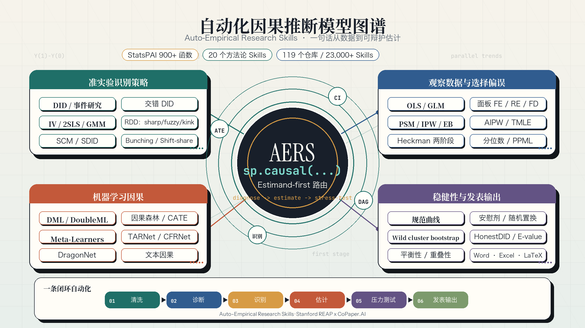

# Auto-Empirical Research Skills (AERS, 23K+ Skills)

> [!NOTE]
> **仓库已更名 → 突出「Auto 自动化」。** 本项目最初名为 *Awesome Agent Skills for Empirical Research*，现已更名为 **Auto-Empirical-Research-Skills (AERS)**。新名字强调核心理念：它不只是一套技能的「集合」，而是一个能**自动跑通整套实证研究流程**的智能体——从原始数据清洗 → 识别与估计 → 稳健性检验 → 生成表格图形 → 直至产出可投稿的论文初稿，全流程自动化、尽量减少人工介入。
>
> GitHub 会自动重定向旧地址，但仍建议更新你的书签与本地 remote：
>
> ```bash
> git remote set-url origin https://github.com/brycewang-stanford/Auto-Empirical-Research-Skills.git
> ```

<div align="center">

**🌐 语言 / Language: 中文 | [English](README.md)**

<br/>

  

  <br/>
  <br/>

  

  <br/>

  <table>
    <tr>
      <td align="center">
        <a href="https://copaper.ai"></a>
      </td>
      <td width="60"></td>
      <td align="center">
        
      </td>
    </tr>
  </table>

  <br/>

  <strong>Stanford REAP × CoPaper.AI</strong> · 实证研究 AI 工具的学术工业级产品<br/>
  <sub>由斯坦福实证研究方法论团队打造，覆盖从数据清洗到顶刊投稿的完整工作流</sub>

  <br/>
</div>

[](https://awesome.re)
[](https://github.com/brycewang-stanford/Auto-Empirical-Research-Skills)
[](https://creativecommons.org/licenses/by-sa/4.0/)
[](CONTRIBUTING.md)
[](https://copaper.ai)
[](https://github.com/brycewang-stanford/StatsPAI)
[](SECURITY-SCAN-REPORT.md)
[](SECURITY-SCAN-REPORT.md)
[](SECURITY-SCAN-REPORT.md)
[](SECURITY-SCAN-REPORT.md)
[](SECURITY-SCAN-REPORT.md)
[](https://github.com/brycewang-stanford/Auto-Empirical-Research-Skills/actions/workflows/validate-catalog.yml)
[](https://scorecard.dev/viewer/?uri=github.com/brycewang-stanford/Auto-Empirical-Research-Skills)

**实证研究全流程 AI Agent Skills 大全 — 收录 119 个 GitHub 仓库 / 覆盖 23,000+ Skills**

> A curated, opinionated list of **119 GitHub repositories** and **23,000+ AI Agent Skills** for empirical research in economics, political science, sociology, psychology, public health, education, management, finance, and public policy — organized by research workflow, from topic selection to journal submission.

2026 年，实证研究的工作方式正在被重新定义。

[**CoPaper.AI**](https://copaper.ai) —— **由 [Stanford REAP（中国经济与制度研究中心）](https://sccei.fsi.stanford.edu/reap)研究者团队孵化的实证研究 AI 助手**——已经做到 **20 分钟完成一篇主流期刊级别的实证论文**：从数据导入、描述性统计、因果推断模型、稳健性检验到结果表格，一步到位。这背后的秘密不是更强的模型，而是 **Skills**：把资深研究者的方法论经验编码成结构化工作流，让 AI 知道"一个完整的 DID 分析应该包含哪些步骤"，而不是每次都等你一步步提醒。

这个仓库，是我们在构建 CoPaper.AI 过程中整理的一份 **Agent Skills 全景图**。我们把散落在 GitHub、社区和学术圈的数百个 Skills 仓库和上万个 Skills 按实证研究流程梳理归类，方便你按需取用。

**🎓 三层信用锚点 · 为什么是我们做这件事**

| 层级 | 锚点 | 抓手 |
|---|---|---|
| 🏛️ **学术血统** | **Stanford REAP / SCCEI** 中国经济与制度研究中心 | 实证经济学方法论领域的学术研究背景，研究者团队在顶刊有持续发表传统 |
| 🔧 **工程落地** | **[CoPaper.AI](https://copaper.ai)** 实证研究 AI 助手 | 内置 **20 个经济学方法论 Skills**（DID/IV/RDD/PSM/DML 等），Supervisor + 4 子代理多智能体架构，一句话触发，结果自动输出 |
| ⚙️ **开源引擎** | **[StatsPAI](https://github.com/brycewang-stanford/StatsPAI)** —— **CoPaper.AI 的因果推断引擎** | **900+ 函数 · 一个 `import statspai as sp` · JOSS 投稿中 · MIT 开源**。CoPaper.AI 跑出的每一个 DID/IV/RD/SCM 估计都由 StatsPAI 驱动；这份 Skills 大全本身也是 StatsPAI 生态的一部分 |

> 🔒 **安全基线**：本仓库最初 52 个 skill 目录 / 2,940+ 文件经[系统性安全扫描](SECURITY-SCAN-REPORT.md) —— **52/52 全部 CLEAN，零 FLAGGED**，零网络外泄、零反向 shell、零 prompt 注入。后续新增 vendor 条目由生成的 catalog / provenance / audit 文件跟踪；高信任场景使用前请运行 `make audit` 复核。
>
> 💡 **想要开箱即用？** 不必自己拼装 Skills —— 直接试试 [**→ copaper.ai**](https://copaper.ai)，让 Stanford 研究方法论团队为你做完整的实证流水线。

---

## 快速开始

- 搜索本地索引：[`docs/search.html`](docs/search.html)
- 浏览自动生成的本地 catalog：[`docs/SKILL_CATALOG.md`](docs/SKILL_CATALOG.md)
- 直接复制常用实证工作流：[`docs/GOLDEN_WORKFLOWS.md`](docs/GOLDEN_WORKFLOWS.md)
- 查看旗舰 demo：[`docs/demos/`](docs/demos/)
- 运行旗舰回归评测提示词：[`docs/EVALS.md`](docs/EVALS.md)
- 安装或复制 skill 到 agent runtime：[`docs/INSTALL.md`](docs/INSTALL.md)
- 使用机器可读索引：[`catalog/skills.json`](catalog/skills.json)
- 协调多 agent 并行工作：[`docs/AGENT_COORDINATION.md`](docs/AGENT_COORDINATION.md)
- 查看 provenance 与 license 风险：[`docs/LICENSE_AUDIT.md`](docs/LICENSE_AUDIT.md)
- 查看贡献与质量门槛：[`docs/QUALITY_GATE.md`](docs/QUALITY_GATE.md) · [`docs/SKILL_SUBMISSION_GUIDE.md`](docs/SKILL_SUBMISSION_GUIDE.md)
- 查看本轮 repo 体检与路线图：[`docs/REPO_AUDIT_2026-05-31.md`](docs/REPO_AUDIT_2026-05-31.md) · [`docs/ROADMAP.md`](docs/ROADMAP.md)
- 本地重建与校验：

```bash
make catalog  # 重新生成 catalog、provenance、audit、enrichment
make validate # freshness + 本地链接/frontmatter 检查
make check    # 完整 gate：validate + Python 编译 + 单元测试 + eval lint + benchmark
```

### 30 秒选工作流

| 目标 | 从这里开始 |
|---|---|
| 跑完整实证分析流水线 | [`StatsPAI_skill`](skills/00-Full-empirical-analysis-skill_StatsPAI/SKILL.md) |
| 审顶刊经济学识别策略 | [`aer-identification`](skills/50-brycewang-aer-skills/skills/aer-identification/SKILL.md) |
| 准备 AER / AEJ 投稿 | [`aer-workflow`](skills/50-brycewang-aer-skills/skills/aer-workflow/SKILL.md) |
| 整理复现包 | [`aer-replication`](skills/50-brycewang-aer-skills/skills/aer-replication/SKILL.md) |
| 降低中文学术 AI 写作痕迹 | [`chinese-de-aigc`](skills/48-copaper-ai-chinese-de-aigc/SKILL.md) |

---

## 🆕 更新日志

<details>
<summary><b>2026-05-25：📕 AER-skills 收录 —— Top-5 经济学 (AER / AER:Insights / AEJ) 投稿专用 9 个 skills（skills/50）+ 周更 vendor sync 闭环</b></summary>

- **📕 [skills/50-brycewang-aer-skills](skills/50-brycewang-aer-skills/)**：本仓库原创姊妹项目 [brycewang-stanford/AER-skills](https://github.com/brycewang-stanford/AER-skills) 整仓 vendor 进来，按 StatsPAI 同款 [`scripts/sync-aer-skills.sh`](scripts/sync-aer-skills.sh) + [`.github/workflows/sync-aer-skills.yml`](.github/workflows/sync-aer-skills.yml) 周一 06:00 UTC 自动跑 diff → 漂移则开 PR 的闭环。**抓手很明确**：Top-5 经济学（AER / AER:Insights / AEJ 全家桶）的投稿专用 skill stack，把 StatsPAI / 00.x 那套"跑分析"延伸到"写论文"。
  - **🧱 9 个 skill 全链路覆盖投稿流水线**：[`aer-topic-selection`](skills/50-brycewang-aer-skills/skills/aer-topic-selection/)（选题路由 AER vs Insights vs AEJ）→ [`aer-identification`](skills/50-brycewang-aer-skills/skills/aer-identification/)（识别策略审计：现代 DiD / 弱 IV / 边界 RDD 避雷）→ [`aer-robustness`](skills/50-brycewang-aer-skills/skills/aer-robustness/)（审稿人导向稳健性矩阵）→ [`aer-introduction`](skills/50-brycewang-aer-skills/skills/aer-introduction/)（Keith Head 五段式 intro）→ [`aer-tables-figures`](skills/50-brycewang-aer-skills/skills/aer-tables-figures/)（AER booktabs 排版）→ [`aer-replication`](skills/50-brycewang-aer-skills/skills/aer-replication/)（AEA Data and Code Availability Policy 复现包，openICPSR 合规）→ [`aer-submission`](skills/50-brycewang-aer-skills/skills/aer-submission/)（投稿 preflight：100 词 abstract、disclosure、cover letter）→ [`aer-rebuttal`](skills/50-brycewang-aer-skills/skills/aer-rebuttal/)（R&R 回复信，针对*revised* manuscript 而非旧稿）→ [`aer-workflow`](skills/50-brycewang-aer-skills/skills/aer-workflow/)（总调度，告诉你下一步用哪个 skill）。
  - **🆚 与现有 skill 的差异化**：StatsPAI / 00.x 解决"如何把分析跑对"；AER-skills 解决"如何把论文写到 Top-5 录用门槛"——AER 100 词 abstract / AER:Insights 7000 词上限 / 45% desk rejection / AEA mandatory replication 这些 Top-5 特定约束，通用 scientific-writing skill（Nature-Paper-Skills 等）一律不覆盖。**identification-first**：先审识别策略，识别脆，再多 prose 也救不回来。
  - **🔁 vendor sync 闭环**：`git clone --depth=1` 上游 → `rsync -a --delete --exclude='.git'` 整仓镜像 → 对比 before/after 内容 hash，无漂移 exit 0，有漂移 exit 1 触发 `peter-evans/create-pull-request@v6` 开 `chore/sync-aer-skills` PR。**支持手动 `workflow_dispatch`**，需要立即同步时一键触发。
  - **License: MIT** —— 同 StatsPAI / 00.x 一致，可商可学。
  - **首版上游 commit**：[`7e9c44d`](https://github.com/brycewang-stanford/AER-skills/commit/7e9c44d363c185edf27859096268b6a8256c4a2b)（2026-05-25，含 modern-aer-exemplars.md 30+ 篇分子领域典范）。

</details>

<details>
<summary><b>2026-05-04：🤝 首个社区 PR 收录 —— humanize-chinese vendor 进 skills/49</b></summary>

- **🇨🇳 [skills/49-voidborne-d-humanize-chinese](skills/49-voidborne-d-humanize-chinese/)**：由 voidborne-d 通过 PR #5 贡献，按 `LICENSE + README-original.md + SKILL.md` 三件套 vendor 进仓库。**同时提供 SKILL.md 和独立 Python CLI**：17 类中文 AI 模式检测 + 7 风格改写器（academic / novel / blog / 小红书 / 微信 等）+ LR ensemble 程序化打分，长度 ≥1500 字自动切长篇 LR，HC3 100 短问答基准 95% 正确分离。**License: MIT (Non-Commercial)** —— 非标准修改版 MIT，明确禁商用（SaaS / 付费 API / 商业产品集成），下游使用请注意。
- **🤝 欢迎社区 PR**：本仓库长期开放收录有价值的实证研究类 Skill / Agent / 工具。无论是你自己开发的还是发现的好工具，欢迎提 PR —— 我们会**继续保持收录**，认真审查每一条贡献，让这份清单成为社区共建的资产。流程参见 [Contributing](#contributing)。

</details>

<details>
<summary><b>2026-04-28：🛡️ 安全扫描基线完成 —— 原始 52 个 Skill 全部 CLEAN，零 FLAGGED</b></summary>

- **🛡️ [SECURITY-SCAN-REPORT.md](SECURITY-SCAN-REPORT.md)**：对仓库原始 **52 个 Skill / 2,940+ 文件**完成系统性安全审查，**未发现任何恶意 prompt、病毒、木马或其他恶意内容**。后续新增 vendor 条目由生成的 provenance / hygiene 元数据覆盖，若要继续做“全仓安全”表述，应按同等标准复核。
  - **🔍 六阶段多层防御**：(1) 13 类风险模式自动化 grep（pipe-to-shell / 反向 shell / 凭据外泄 / 解码执行 / 挖矿 RAT 签名 / Prompt 注入等）→ (2) 6 个含 hook 的 skill、40+ hook 脚本 100% 人工核查 → (3) 三 Agent 并行审查 SKILL.md / agent 定义 / reference 文档 → (4) 补充完整性检查（隐藏 Unicode / 编码异常 / 极长行 / HTML 注入 / 网络相关 import）。
  - **📊 结果分布**：所有看似敏感的命中均为三类合法内容 —— **防御性安全规则**（deny rule、bash-safety hook、凭据检测器）、**合法学术 API 调用**（arXiv / CrossRef / PubMed / FRED / World Bank 等）、**标准 Claude Code 本地 hook**（脚手架 / 状态保存 / context 监控，全部本地操作、零网络 IO）。
  - **🔑 关键洞察**：**17-DAAF 反而是这批 Skill 中"安全意识最强"的参考样板**（14 个防御 hook + 32 条 deny rule + 主动凭据扫描）；规模最大 ≠ 风险最高。
  - **📈 可视化信息图**：报告内嵌 5 张 zhihu 风格信息图（[总览](images/security-scan/security-scan-01-总览.png) / [六阶段方法论](images/security-scan/security-scan-02-扫描方法.png) / [威胁矩阵](images/security-scan/security-scan-03-威胁矩阵.png) / [Top 5 规模分布](images/security-scan/security-scan-04-规模分布.png) / [二轮补扫](images/security-scan/security-scan-05-补扫结果.png)），3 秒可懂。
  - 详见 [**完整安全扫描报告**](SECURITY-SCAN-REPORT.md)。

</details>

<details>
<summary><b>2026-04-24：📗 Full Empirical Analysis Skill (R) 正式收录 —— tidyverse + fixest 8 步闭环（skills/00.3）</b></summary>

- **📗 [Full Empirical Analysis Skill — R](skills/00.3-Full-empirical-analysis-skill_R/)**：与 StatsPAI / 00.1 / 00.2 形成**同日四联**的 R 版本，放在 [`skills/00.3-Full-empirical-analysis-skill_R/`](skills/00.3-Full-empirical-analysis-skill_R/) —— **第 0.3 位，覆盖 R 与 Quarto 用户**。
  - **🧱 现代 tidyverse + fixest 生态**：`dplyr` / `tidyr` / `haven` 处理数据；`fixest::feols/feglm/fepois` 作为面板/IV/DID 主力（一行代码搞定 HD FE + 多向 cluster + IV）；`did::att_gt` + `fixest::sunab` + `didimputation::did_imputation` + `synthdid` + `DIDmultiplegtDYN` + `bacondecomp` + `HonestDiD` 处理现代 DID；`rdrobust` / `rddensity` / `rdmulti` / `rdlocrand` 处理 RD；`Synth` / `gsynth` / `tidysynth` / `synthdid` 处理合成控制；`MatchIt` / `WeightIt` / `cobalt` / `ebal` 处理匹配；`grf::causal_forest` + `DoubleML` 处理 ML 因果；`mediation::mediate` + `lavaan::sem` 处理中介；`marginaleffects::avg_slopes` / `plot_slopes` 处理后估计；`modelsummary` / `kableExtra` / `gt` / `flextable` 出版级表格；`ggplot2` + `iplot` + `binsreg` + `cowplot` + `patchwork` 出图；`Quarto` 一键生成 PDF/HTML/Word 一体化报告。
  - **🔁 8 步 R 闭环（与 00.1 / 00.2 同结构）**：(1) 数据导入与清洗（`read_dta` + `clean_names` + `naniar::vis_miss` + `mice` + `validate` / `assertr`）→ (2) 变量构造（`mutate` + `across` + `DescTools::Winsorize` + `scale` + `arrange %>% group_by %>% lag/lead`）→ (3) 描述统计（`gtsummary::tbl_summary` + `modelsummary::datasummary_balance` + `psych::corr.test` + `corrplot` / `ggcorrplot`）→ (4) 12 类诊断检验（`shapiro.test` / `tseries::jarque.bera.test` / `lmtest::bptest` / `dwtest` / `bgtest` / `car::vif` / `tseries::adf.test` / `kpss.test` / `plm::pbgtest` / `pcdtest` / `phtest` / `lmtest::resettest`）→ (5) 12 类估计器（`feols` + `AER::ivreg` + `did::att_gt` + `fixest::sunab` + `didimputation` + `synthdid` + `rdrobust` + `tidysynth` + `gsynth` + `MatchIt` + `WeightIt` + `ebal` + `grf::causal_forest` + `DoubleML` + `sampleSelection::heckit` + `quantreg::rq` + `lavaan::sem`）→ (6) 稳健性（`modelsummary` 出 M1–M6 + `clubSandwich` 多 cluster + `fwildclusterboot::boottest` + `ri2::conduct_ri` + `bacondecomp::bacon` + `HonestDiD::createSensitivityResults` + `robomit::o_test/o_beta`）→ (7) 进一步分析（formula 交互 + `marginaleffects::plot_slopes` + `mediation::mediate` + `medsens` 敏感性 + `lavaan::sem` 多组 SEM + `grf::causal_forest` CATE + `splines::ns` 剂量反应）→ (8) 发表级输出（`modelsummary` 一键出 LaTeX/Word/HTML/Markdown + `fixest::iplot` + `marginaleffects::plot_slopes/predictions` + `cowplot::plot_grid` + `patchwork` + `Quarto` 渲染）。
  - **📚 渐进披露 + Quarto 友好**：`SKILL.md` 主干 893 行（含完整包安装清单、项目目录骨架、Quarto YAML 模板），8 个 [`references/NN-*.md`](skills/00.3-Full-empirical-analysis-skill_R/references/) 合计 3700+ 行深度手册。Quarto 模板让"narrative + 代码 + 表 + 图"在一个 `.qmd` 文件里渲染成最终报告。
  - **🆚 四联定位**：StatsPAI = Python 一键 DSL；00.1 = Python 显式生态；00.2 = Stata 显式生态；00.3 = **R + tidyverse + Quarto**。四者并行收录，**Quarto 复现报告 / 顶刊 R 复现包 / 学术博客的首选**。
  - **适用场景**：用 Quarto 生成期刊级复现报告、学术博客（`distill` / `quarto blog`）、研究生 R 课程教学、需要 `marginaleffects` + `mediation` + `grf` 全套现代后估计的研究、Bayesian 之外的所有 R 实证场景。

</details>

<details>
<summary><b>2026-04-24：📊 Full Empirical Analysis Skill (Stata) 正式收录 —— 传统 Stata 生态 8 步 .do 闭环（skills/00.2）</b></summary>

- **📊 [Full Empirical Analysis Skill — Stata](skills/00.2-Full-empirical-analysis-skill_Stata/)**：与 StatsPAI / 00.1 形成**同日三联**的 Stata 版本，放在 [`skills/00.2-Full-empirical-analysis-skill_Stata/`](skills/00.2-Full-empirical-analysis-skill_Stata/) —— **第 0.2 位，覆盖 Stata 用户**。
  - **🧱 传统 Stata 生态，de-facto 标准命令链**：每步显式调用社区事实标准命令 `reghdfe` / `ivreg2` / `ivreghdfe` / `csdid` / `did_imputation` / `eventstudyinteract` / `sdid` / `did_multiplegt_dyn` / `bacondecomp` / `honestdid` / `rdrobust` / `rddensity` / `synth` / `synth_runner` / `psmatch2` / `teffects` / `ebalance` / `ppmlhdfe` / `boottest` / `ritest` / `rwolf` / `psacalc` / `coefplot` / `esttab` / `outreg2` / `asdoc` / `binscatter` —— **审稿人级 Stata 复现包，一份 ssc install 装齐 30+ 包**。
  - **🔁 8 步 .do 闭环（与 00.1 同结构、Stata 化重写）**：(1) 数据导入与清洗（`use`/`import excel`/`import sas`/`destring`/`misstable`/`mdesc`/`duplicates report`/`merge m:1 ... assert(match using)`/`xtset`/`xtdescribe`/`mi impute chained`）→ (2) 变量构造（`winsor2 by(industry year)`/`egen std`/`xtile`/`xtset` 后的 `L./F./D./S.` 操作子/CPI 平减/`first_treat`+`rel_time`+`gvar`）→ (3) 描述统计（`tabstat`/`balancetable`/`asdoc sum`/`pwcorr, sig star(.05)`/`heatplot`/`twoway kdensity`/`xtdescribe`）→ (4) 诊断检验（12 类：`swilk`/`sktest`/`estat hettest`/`estat imtest, white`/`xtserial`/`xttest3`/`xtcsd, pesaran`/`estat vif`/`dfuller`/`kpss`/`xtunitroot ips/llc`/`hausman fe re`/`estat ovtest`/`linktest`）→ (5) 基准建模（12 类估计器：`reghdfe`+`areg`+`xtreg, fe/re`/`ivreg2`+`ivreghdfe`+`ivregress liml/gmm`/`csdid`+`eventstudyinteract`+`did_imputation`+`sdid`+`did_multiplegt_dyn`/`rdrobust`+`rdmc`+`rddensity`/`synth`+`synth_runner`/`psmatch2`+`teffects psmatch/ipwra/aipw`+`ebalance`+`cem`/`heckman`+`heckprob`/`qreg`+`sqreg`/`ppmlhdfe`/`sem`+`gsem`）→ (6) 稳健性（`eststo`+`esttab` M1–M6 规范阶梯、多 cluster 层级、`boottest` wild cluster bootstrap、`ritest` 随机化推断、`rwolf`+`wyoung` 多重检验、`bacondecomp` TWFE 诊断、`honestdid` PT 敏感性、`psacalc delta` Oster δ\*）→ (7) 进一步分析（factor-var 交互+`margins`+`marginsplot`/`suest` cross-equation Wald/DDD/outcome ladder coefplot/`medsem`+`khb`+`sem` `estat teffects`/dose-response via `xtile` 或 `bspline`/Stata-Python 桥到 `econml` 算 CATE/spillover）→ (8) 发表级表图（`esttab`+`outreg2`+`asdoc` 出 `.tex`/`.rtf`/`.docx`/`.xlsx`，`coefplot`+`marginsplot`+`binscatter`+`rdplot`+`graph combine` 出 `.pdf`）。
  - **📚 渐进披露架构**：`SKILL.md` 主干 801 行（含 ssc install 总清单 + 完整 .do 骨架 + 选包速查表），8 个 [`references/NN-*.md`](skills/00.2-Full-empirical-analysis-skill_Stata/references/) 合计 3500+ 行深度手册，按需加载。
  - **🆚 三联定位**：StatsPAI = Python 一键 DSL；00.1 = Python 显式生态；00.2 = **Stata 显式生态**。三者并行收录、互不替代 —— **审稿人 / 合作者只接受 Stata 复现时，这是唯一抓手**。
  - **适用场景**：审稿人级 Stata 复现包、研究生 Stata 课程教学、应用经济学顶刊（AER/QJE/JPE/ReStud）的标准 .do 流水线、需要 `bacondecomp`+`honestdid`+`psacalc` 全套现代 DID 工具的严谨研究。

</details>

<details>
<summary><b>2026-04-24：📘 Full Empirical Analysis Skill 正式收录 —— 传统 Python 计量生态 8 步闭环（skills/00.1）</b></summary>

- **📘 [Full Empirical Analysis Skill](skills/00.1-Full-empirical-analysis-skill_Python/)**：与 StatsPAI 互为**同日双更 / 哲学对位**的姊妹 skill，放在 [`skills/00.1-Full-empirical-analysis-skill_Python/`](skills/00.1-Full-empirical-analysis-skill_Python/) —— **第 0.1 位，显式可审计的对照组**。
  - **🧱 传统 Python 计量生态，无 DSL 包裹**：每步显式调用 `pandas` / `numpy` / `scipy` / `statsmodels` / `linearmodels` / `pyfixest` / `rdrobust` / `econml` / `causalml` / `matplotlib` / `seaborn` —— Agent 写出的每一行代码都能被逐行审计、逐行替换。
  - **🔁 8 步完整闭环（比 StatsPAI 的 6 步更细颗粒度）**：(1) 数据清洗（MCAR/MAR/MNAR、IQR/z/Mahalanobis 异常值、`validate=` 防 m:m 合并、面板结构校验）→ (2) 变量构造（log/IHS/Box–Cox、1/99 缩尾、z/MinMax/Robust 标准化、交互/滞后/差分、CPI 平减、交错 DID 时间变量）→ (3) 描述统计与 Table 1（带 SMD+t 检验的分层表、相关热图+显著性星、4 类分布图、DID 动机图、面板覆盖热图）→ (4) 诊断检验（12 类：正态/异方差/自相关/多重共线/平稳/协整/内生/弱工具/过度识别/面板 Hausman/设定 RESET/杠杆 Cook's D）→ (5) 基准建模（12 类估计器：OLS/面板 FE-RE-FD/GLM/IV-2SLS-LIML-GMM/DID 五家-2×2/TWFE/事件研究/CS/SA/BJS/SDiD/RD-Sharp/Fuzzy/Kink/多断点/SC/PSM/IPW/EB/DML/因果森林/Heckman/分位数）→ (6) 稳健性电池（M1–M6 规范梯度、cluster 级别敏感性、wild cluster bootstrap、安慰剂 timing+permutation、规范曲线、Oster δ\*、LOO、Rosenbaum）→ (7) 进一步分析（异质性 4 法/机制 outcome ladder/Baron–Kenny+Imai 中介/调节 margins plot/moderated mediation/dose-response/spillover）→ (8) 发表级表图（`stargazer` / `pyfixest.etable` / coefplot / event-study / binscatter / forest / RD plot / CATE 热图 / love plot，全套 LaTeX/Word/Excel 导出）
  - **📚 渐进披露架构**：`SKILL.md` 只给每步最常用的那一种写法（610 行主干），变体下沉到 8 个 [`references/NN-*.md`](skills/00.1-Full-empirical-analysis-skill_Python/references/)（合计 3000+ 行深度手册），**主干轻、细节厚**，Agent 用到时才加载。
  - **🆚 与 StatsPAI 的对位关系**：StatsPAI = **agent-native 一键 DSL**（`sp.causal(...)` 一句跑完）；本 skill = **显式传统生态**（每行代码都能换库、逐行审计）。两者并行收录、互不替代 —— 信任 DSL 时用 StatsPAI，要教学/审计/全量控制时用本 skill。
  - **适用场景**：复现应用经济学论文、审稿人级别的逐行审计、研究生教学、需要把"每一个诊断检验和稳健性都挂进 pipeline"的严谨实证项目。

</details>

<details>
<summary><b>2026-04-24：🔥 StatsPAI Skill 正式收录 —— 一条龙自动化完成全部实证分析（skills/00）</b></summary>

- **🔥🔥 [StatsPAI Skill](skills/00-Full-empirical-analysis-skill_StatsPAI/)**：我们自研的 **Agent-Native 实证分析一体化 Skill** 正式收录本仓库，放在 [`skills/00-Full-empirical-analysis-skill_StatsPAI/`](skills/00-Full-empirical-analysis-skill_StatsPAI/) —— **第 0 位，仓库门面**。
  - **🚀 一条龙自动化完成全部实证分析**：从数据清洗（pandas 前置）→ EDA & 描述统计（`sp.sumstats` / `sp.balance_table`）→ 预检诊断（`sp.diagnose` / `sp.balance_panel` / 重叠性 / 缺失性）→ 研究问题 DSL（`sp.causal_question(...).identify()`）→ LLM 辅助 DAG 发现（`sp.llm_dag_propose` / `validate` / `constrained`）→ 一键编排估计（`sp.causal(...)`）→ 稳健性检验（`sp.spec_curve` / `sp.honest_did` / `sp.evalue`），**6 步完整闭环，无需切换工具，Agent 一句话跑完**。
  - **900+ 函数，一个 `import statspai as sp` 搞定**：相比 2026-04-12 的 390+ 函数版本，函数数量翻倍多，覆盖 OLS、IV、面板、DID（Callaway-Sant'Anna / Sun-Abraham / Bacon / HonestDID / 连续 DID）、RDD（Sharp / Fuzzy / 多断点 / Kink）、PSM、SCM、SDID、DML、因果森林、Meta-Learners、TMLE、AIPW、神经因果模型（TARNet / CFRNet / DragonNet）、**文本因果（`sp.causal_text`）**、Heckman、结构估计（BLP）。
  - **Agent-Native 自描述 API**：`sp.list_functions()` / `sp.describe_function()` / `sp.function_schema()` —— Agent 无需查文档即可发现和理解每个函数；统一 `CausalResult` 对象带 `.summary()` / `.plot()` / `.to_latex()` / `.to_word()` / `.to_excel()` / `.cite()` 和结构化 `.diagnostics` 字典，**天然适配 LLM 驱动的工作流**。
  - **Estimand-first 决策**：`sp.causal_question` 让 "DID vs RD vs IV？" 的选择**显式化、可辩护**，不再靠猜。
  - **JOSS 投稿中，MIT 开源**。[→ PyPI](https://pypi.org/project/StatsPAI/) | [→ GitHub](https://github.com/brycewang-stanford/StatsPAI) | [→ 本地 Skill](skills/00-Full-empirical-analysis-skill_StatsPAI/)
- **🔁 每周上游自动同步**：新增 GitHub Action，每周从 StatsPAI 主仓库自动拉取最新 `SKILL.md` / `README.md` 到 [`skills/00-Full-empirical-analysis-skill_StatsPAI/`](skills/00-Full-empirical-analysis-skill_StatsPAI/)，**用户永远拿到最新版**。
- 修正了 StatsPAI Skill 代码示例中若干 `sp.*` 函数签名，Step 0-6 代码块明确标注为 illustrative 示例（防止 Agent 照抄出错）。

</details>

<details>
<summary><b>2026-04-13：🇨🇳 原创中文降 AIGC Skill 上线（skills/48）</b></summary>

- **🇨🇳🔥 [chinese-de-aigc](skills/48-copaper-ai-chinese-de-aigc/)**：**CoPaper.AI 团队原创的中文学术降 AIGC Skill**。目前 GitHub 上唯一面向中文学术实证论文、针对知网 AMLC / 万方 / 维普 / Turnitin 中文版的 humanizer。
  - **17 类中文 AI 痕迹模式库**（四字套话 / 虚词堆叠 / 显性连接词 / 绝对化断言 / 总分总对称 / 句长方差等）
  - **五步闭环工作流**：定位 → 诊断 → 差异化改写 → 五维自评 → 二次复查
  - **分章节差异化策略**：摘要/引言/文献综述/方法/结果/讨论/结论的改写力度各不相同
  - **五维评分量表**：具体性 / 节奏性 / 谨慎性 / 隐衔接 / 研究者语气（加权满分 50）
  - **12 组改写前后对照**覆盖实证论文七大章节
  - 设计思想吸收了英文 humanizer 的顶层架构（humanizer_academic / skill-deslop / stop-slop / avoid-ai-writing），但**针对中文语境完全重新设计**

</details>

<details>
<summary><b>2026-04-12：新增 StatsPAI Agent-Native 计量包 + 降 AIGC 检测率 Skills</b></summary>

- **🔥 [StatsPAI](https://github.com/brycewang-stanford/StatsPAI)**：我们自研的 **Agent-Native 因果推断 & 计量经济学 Python 包**。390+ 函数，一个 `import`，自描述 API（`list_functions()` / `describe_function()` / `function_schema()`）。覆盖 OLS、IV、DID（Callaway-Sant'Anna / Sun-Abraham / Bacon / HonestDID / 连续 DID）、RDD、PSM、SCM、DML、因果森林、Meta-Learners、TMLE、神经因果模型（TARNet/CFRNet/DragonNet）等。JOSS 发表，MIT 开源。[→ PyPI](https://pypi.org/project/StatsPAI/) | [→ GitHub](https://github.com/brycewang-stanford/StatsPAI)
- **📝 降 AIGC 检测率 Skills**（新增 4 个，[→ 专项分类](#-降-aigc-检测率--学术去-ai-味重点推荐)）：
  - [humanizer_academic](https://github.com/matsuikentaro1/humanizer_academic) — 学术论文专用，23 种 AI 写作模式检测（`skills/44`）
  - [skill-deslop](https://github.com/stephenturner/skill-deslop) — 科学写作去 AI 化，尊重学科惯例（`skills/45`）
  - [stop-slop](https://github.com/hardikpandya/stop-slop) — 三层检测 + 五维评分（`skills/46`）
  - [avoid-ai-writing](https://github.com/conorbronsdon/avoid-ai-writing) — 结构化审计 + 重写 + 二次审计（`skills/47`）
- **🛡️ [revision-guard](https://github.com/ShiyanW/ai-revision-guard)**：防止 AI 越改越差，限制修改轮次 + 7 项同质化检测（社区 PR 贡献）

</details>

<details>
<summary><b>2026-04-11：从 43 个集合扩展至 119 个仓库，覆盖 23,000+ Skills</b></summary>

- 新增 76 个 GitHub 仓库，覆盖 8 大社科学科（经济学、政治学、社会学、心理学、教育学、公共健康、管理学、金融学）
- 新增金融、法律、营销、产品管理、教育、公共健康等领域 Skill 套件
- 新增 13 个学术数据 MCP 服务器（OpenAlex、Semantic Scholar、FRED、World Bank 等）
- 新增 11 个多代理协作系统（Agent Laboratory、AI-Scientist-v2 等）
- 新增中英双语 README

</details>

---

## 目录

- [快速开始](#快速开始)
- [🆕 更新日志](#-更新日志)
- [这份列表能帮你什么？](#这份列表能帮你什么)
- [按研究流程速查](#按研究流程速查)
- **Skills 分类详解**
  - [01 - 选题与研究设计](docs/01-选题与研究设计.md)
  - [02 - 文献检索与综述](docs/02-文献检索与综述.md)
  - [03 - 论文阅读与拆解](docs/03-论文阅读与拆解.md)
  - [04 - 数据获取与清洗](docs/04-数据获取与清洗.md)
  - [05 - 统计分析与因果推断](docs/05-统计分析与因果推断.md)
  - [06 - 论文写作](docs/06-论文写作.md)
  - [07 - 论文修改与润色](docs/07-论文修改与润色.md)
  - [08 - 引用管理与排版](docs/08-引用管理与排版.md)
  - [09 - 论文复现与可复现研究](docs/09-论文复现与可复现研究.md)
  - [10 - 审稿回复与学术答辩](docs/10-审稿回复与学术答辩.md)
- [综合型 Skill 套件](#综合型-skill-套件)
  - 🚨 [降 AIGC 检测率 & 学术去 AI 味（重点推荐）](#-降-aigc-检测率--学术去-ai-味重点推荐)
- [多代理协作系统](#多代理协作系统)
- [Skill 聚合平台与发现工具](#skill-聚合平台与发现工具)
- [学习资源](#学习资源)
- [🛡️ 安全扫描](#-安全扫描)
- [Contributing](#contributing)

---

## 这份列表能帮你什么？

如果你正在做实证研究，大概经历过这些场景：

- 让 AI 帮你跑一个 DID，它给了基准回归就停了。你说"平行趋势呢"，它补一个。"安慰剂检验呢"，再补一个。**每次都像挤牙膏。**
- 好不容易写完初稿，引用格式一塌糊涂，还夹了几条 AI 编造的假引用。
- 想复现一篇顶刊的识别策略到自己的研究里，但从读懂到落地隔了一座山。

**问题不在于 AI 不会做——在于它不知道完整的流程应该包含哪些步骤。**

Skill 就是解决这个问题的：它是给 AI 的**方法论操作手册**。有了 Skill，AI 知道"跑 DID 应该先做平行趋势检验，再做基准回归，再做 4 项稳健性检验，再做异质性分析，再做机制分析，每一步的输出格式是什么"。你只需要说"帮我做 DID 分析"，剩下的它自己按流程走完。

这份列表按照实证研究的完整流程，帮你找到每个阶段最好用的 Skills。

---

## 按研究流程速查

> 不确定该用哪个 Skill？从你当前所处的研究阶段出发：

```
选题构思 → 文献检索 → 文献精读 → 研究设计 → 数据获取
   │           │          │          │          │
   ▼           ▼          ▼          ▼          ▼
  01          02         03         01         04
                                              
数据清洗 → 统计分析 → 论文初稿 → 修改润色 → 排版引用
   │           │          │          │          │
   ▼           ▼          ▼          ▼          ▼
  04          05         06         07         08

论文复现 → 投稿审稿 → 审稿回复 → 答辩展示
   │           │          │          │
   ▼           ▼          ▼          ▼
  09          10         10         10
```

### 一站式方案

如果你不想逐个挑选，以下方案直接覆盖全流程：

| 方案 | 覆盖范围 | 特点 | 链接 |
|------|---------|------|------|
| **CoPaper.AI** | 数据分析 → 论文写作 | 20 个方法论 Skills 内置，多代理架构，20 分钟完成主流期刊级别实证论文 | [copaper.ai](https://copaper.ai) |
| **StatsPAI Skill** 🔥🔥 | **一条龙自动化：从数据清洗到实证建模** | **900+ 函数，一个 `import statspai as sp`**。Agent 一句话跑完 EDA → 预检 → 研究问题 DSL → DAG 发现 → 模型估计 → 稳健性检验的 6 步完整闭环。Agent-native 自描述 API，覆盖 OLS/IV/DID(含 Callaway-Sant'Anna、Sun-Abraham、HonestDID、连续 DID)/RDD/PSM/SCM/DML/因果森林/神经因果/文本因果，发表级输出（Word/Excel/LaTeX） | [本地 Skill](skills/00-Full-empirical-analysis-skill_StatsPAI/) · [GitHub](https://github.com/brycewang-stanford/StatsPAI) |
| **Full Empirical Analysis Skill** 📘 | **传统 Python 生态显式 8 步闭环**（StatsPAI 的哲学对位） | 不引入任何 DSL 包裹，Agent 直接调用 `pandas` / `statsmodels` / `linearmodels` / `pyfixest` / `rdrobust` / `econml` / `causalml` / `matplotlib`。覆盖**数据清洗 → 变量构造 → 描述统计 → 诊断检验 → 建模 → 稳健性 → 机制/异质性/中介/调节 → 发表级表图** 8 步，每步配深度参考手册。适合教学、审稿级审计、需要逐行控制的严谨复现 | [本地 Skill](skills/00.1-Full-empirical-analysis-skill_Python/) |
| **Full Empirical Analysis Skill — Stata** 📊 | **Stata 显式 .do 8 步闭环**（同步 00.1 的 Stata 版） | `reghdfe` + `ivreg2` + `csdid` + `did_imputation` + `eventstudyinteract` + `sdid` + `rdrobust` + `synth` + `psmatch2` + `teffects` + `ebalance` + `boottest` + `ritest` + `rwolf` + `bacondecomp` + `honestdid` + `coefplot` + `esttab` + `outreg2` + `asdoc` + `binscatter`。同样 8 步，从 `use` / `import` 一直到 `.tex` / `.rtf` 表 + `.pdf` 图。审稿人级 Stata 复现首选 | [本地 Skill](skills/00.2-Full-empirical-analysis-skill_Stata/) |
| **Full Empirical Analysis Skill — R** 📗 | **tidyverse + fixest 8 步闭环 + Quarto 渲染**（同步 00.1 / 00.2 的 R 版） | `dplyr` + `haven` + `fixest` + `did` + `synthdid` + `bacondecomp` + `HonestDiD` + `rdrobust` + `tidysynth` + `gsynth` + `MatchIt` + `WeightIt` + `cobalt` + `ebal` + `grf` + `DoubleML` + `mediation` + `lavaan` + `marginaleffects` + `modelsummary` + `kableExtra` + `gt` + `flextable` + `ggplot2` + `iplot` + `binsreg` + `cowplot`。8 步均可塞进一个 `.qmd` 文件，`quarto render` 一键产出 PDF/HTML/Word 一体化复现报告。 | [本地 Skill](skills/00.3-Full-empirical-analysis-skill_R/) |
| **Claude Scholar** | 选题 → 投稿 | 25+ Skills 覆盖研究全生命周期，集成 Zotero MCP | [GitHub](https://github.com/Galaxy-Dawn/claude-scholar) |
| **K-Dense Scientific Skills** | 跨学科科学研究 | 140+ Skills，28+ 科学数据库，55+ Python 包 | [GitHub](https://github.com/K-Dense-AI/claude-scientific-skills) |
| **AI-Research-SKILLs** | AI/ML 研究 | 22 个类别、87 个技能，完整研究周期 | [GitHub](https://github.com/Orchestra-Research/AI-Research-SKILLs) |
| **OpenClaw Medical Skills** | 生物医学/公共健康 | **869 个 Skills**，流行病学、临床研究、药物安全、生物统计 | [GitHub](https://github.com/FreedomIntelligence/OpenClaw-Medical-Skills) |
| **Agent Laboratory** | 全自主研究 | 文献综述 → 实验 → 报告，研究成本降低 84% | [GitHub](https://github.com/SamuelSchmidgall/AgentLaboratory) |

---

## 综合型 Skill 套件

这些是包含多个 Skills 的综合型仓库，通常覆盖研究的多个阶段：

### 学术研究专用

| 套件 | Stars | Skills 数 | 核心特色 | 社科适配 |
|------|-------|----------|---------|---------|
| [K-Dense-AI/claude-scientific-skills](https://github.com/K-Dense-AI/claude-scientific-skills) | 8,799 | 140+ | 28+ 科学数据库（OpenAlex、PubMed），scientific-writing + literature-review + statistical-analysis | ⭐⭐⭐⭐ |
| [Orchestra-Research/AI-Research-SKILLs](https://github.com/Orchestra-Research/AI-Research-SKILLs) | 3,637 | 87 | 22 个类别，ML 论文写作，LaTeX 模板，引文验证 | ⭐⭐⭐ |
| [Imbad0202/academic-research-skills](https://github.com/Imbad0202/academic-research-skills) | ~1,790 | 多个 | 完整论文管线（research → write → review → revise → finalize），风格校准，幻觉检测 | ⭐⭐⭐⭐ |
| [Galaxy-Dawn/claude-scholar](https://github.com/Galaxy-Dawn/claude-scholar) | - | 25+ | 研究全生命周期：选题 → 综述 → 实验 → 写作 → 审稿回复，集成 Zotero MCP | ⭐⭐⭐⭐⭐ |
| [luwill/research-skills](https://github.com/luwill/research-skills) | 209 | 3 | 研究提案生成（research-proposal）、医学综述写作、论文转幻灯片，双语支持 | ⭐⭐⭐⭐⭐ |
| [lishix520/academic-paper-skills](https://github.com/lishix520/academic-paper-skills) | 22 | 2 | Strategist（7 维度审稿人模拟）+ Composer（系统化写作），适合人文社科 | ⭐⭐⭐⭐ |
| [Data-Wise/claude-plugins](https://github.com/Data-Wise/claude-plugins) | - | 17 | 统计研究专用：arXiv 搜索、DOI 查询、BibTeX 管理、方法论写作、审稿回复 | ⭐⭐⭐⭐⭐ |

### 经济学/因果推断专用

| 套件 | 核心特色 | 适用场景 |
|------|---------|---------|
| **[CoPaper.AI](https://copaper.ai)** | **20 个方法论 Skills**（OLS、DID、交错DID、IV、RDD、PSM、SCM、DML、因果森林等），多代理架构（Supervisor + 4 子代理），智能路由，结果自动输出 | 经济学实证研究全流程 |
| **[StatsPAI Skill](skills/00-Full-empirical-analysis-skill_StatsPAI/)** 🔥🔥 | **一条龙自动化完成全部实证分析**。Agent-native 计量经济学 Python 包：**900+ 函数**，一个 `import statspai as sp` 搞定 EDA → 研究问题 DSL → LLM 辅助 DAG 发现 → 估计 → 稳健性检验的完整闭环。自描述 API（`list_functions()` / `describe_function()` / `function_schema()`），统一 `CausalResult` 对象。覆盖 OLS、IV、面板数据、DID（Callaway-Sant'Anna / Sun-Abraham / Bacon / HonestDID / 连续 DID）、RDD（Sharp/Fuzzy/多断点/Kink）、PSM、SCM、SDID、DML、因果森林、Meta-Learners、TMLE、AIPW、神经因果模型（TARNet/CFRNet/DragonNet）、**文本因果（`sp.causal_text`）**、Heckman、结构估计（BLP）。**JOSS 投稿中，MIT 协议** | 实证研究全流程自动化：数据清洗后一句话跑完 EDA → 建模 → 稳健性 |
| **[Full Empirical Analysis Skill](skills/00.1-Full-empirical-analysis-skill_Python/)** 📘 | **传统 Python 计量生态的显式 8 步闭环**（与 StatsPAI 互为哲学对位：一个 DSL 一键跑，一个显式逐行跑）。不引入任何封装包，直接驱动 `pandas` + `numpy` + `scipy` + `statsmodels` + `linearmodels` + `pyfixest` + `rdrobust` + `econml` + `causalml` + `matplotlib` + `seaborn`。8 步细颗粒闭环：(1) 数据清洗（MCAR/MAR/MNAR、IQR/z/Mahalanobis、`validate=` 防 m:m、面板结构校验）→ (2) 变量构造（log/IHS/Box–Cox、1/99 缩尾、z/MinMax/Robust、交互/滞后/差分、CPI 平减、交错 DID 时间变量）→ (3) 描述统计（SMD+t 检验分层 Table 1、相关热图带显著性星、分布 4 联图、DID 动机图、面板覆盖热图）→ (4) 诊断检验（12 类：正态/异方差/自相关/共线/平稳/协整/内生/弱 IV/过识别/Hausman/RESET/Cook's D）→ (5) 建模（OLS/面板 FE-RE-FD/GLM/IV-2SLS-LIML-GMM/DID 五家/RD 四类/SC/PSM-IPW-EB/DML/CF/Heckman/QR 共 12 类）→ (6) 稳健性（M1–M6 规范梯度、cluster 敏感性、wild bootstrap、安慰剂、规范曲线、Oster δ\*、LOO、Rosenbaum）→ (7) 进一步分析（异质性 4 法/机制 outcome ladder/Baron–Kenny+Imai 中介/moderated mediation/dose-response/spillover）→ (8) 发表级表图（`stargazer`/`etable`/coefplot/event-study/binscatter/forest/RD plot/CATE 热图/love plot + LaTeX/Word/Excel 导出）。**SKILL.md 主干 610 行 + 8 个深度 references 3000+ 行，按需加载** | 教学、审稿人级审计、研究生复现训练、需要逐行控制与全量诊断的严谨实证项目 |
| **[Full Empirical Analysis Skill — Stata](skills/00.2-Full-empirical-analysis-skill_Stata/)** 📊 | **传统 Stata 生态的显式 .do 8 步闭环**（00.1 的 Stata 版，与之同结构、同节奏）。一份 `ssc install` 装齐 30+ 包，全程使用社区事实标准命令链：`reghdfe` / `ivreg2` / `ivreghdfe` / `csdid` / `did_imputation` / `eventstudyinteract` / `sdid` / `did_multiplegt_dyn` / `bacondecomp` / `honestdid` / `rdrobust` / `rddensity` / `synth` / `synth_runner` / `psmatch2` / `teffects` / `ebalance` / `ppmlhdfe` / `boottest` / `ritest` / `rwolf` / `psacalc` / `coefplot` / `esttab` / `outreg2` / `asdoc` / `binscatter`。8 步：(1) `use`+`import`+`destring`+`misstable`+`merge assert`+`xtset` 清洗 → (2) `winsor2`+`xtile`+`L./F./D./S.`+CPI 平减+staggered timing → (3) `tabstat`+`balancetable`+`asdoc`+`pwcorr sig star`+`heatplot` → (4) 12 类 estat 诊断 → (5) 12 类估计器（`reghdfe`+5 家 DID+4 类 RD+`synth`+`teffects`+`ebalance`+`heckman`+`qreg`+`ppmlhdfe`+`sem/gsem`）→ (6) `eststo`+`esttab` M1–M6+`boottest`+`ritest`+`rwolf`+`bacondecomp`+`honestdid`+`psacalc delta` → (7) factor-var+`margins`+`marginsplot`+`suest`+DDD+`medsem`+`khb`+SEM+Stata-Python 桥到 econml CATE → (8) `esttab`+`outreg2`+`asdoc` 出 `.tex/.rtf/.docx/.xlsx`，`coefplot`+`marginsplot`+`binscatter`+`rdplot`+`graph combine` 出 `.pdf`。**SKILL.md 主干 801 行 + 8 个深度 references 3500+ 行 + 完整 .do 骨架，按需加载** | 审稿人 / 合作者只接受 Stata 的复现包、研究生 Stata 课程、应用经济学顶刊（AER/QJE/JPE/ReStud）的标准 .do 流水线 |
| **[Full Empirical Analysis Skill — R](skills/00.3-Full-empirical-analysis-skill_R/)** 📗 | **现代 tidyverse + fixest + Quarto 生态的显式 8 步闭环**（00.1 / 00.2 的 R 版，四联 skill 的最后一块）。一份 `install.packages(...)` 装齐 50+ 包，全程使用 R 现代事实标准：`dplyr` / `tidyr` / `haven` / `janitor` / `naniar` / `mice` / `validate` / `assertr` 处理数据；`fixest::feols/feglm/fepois` 一行实现 HD FE + 多向 cluster + IV；`did::att_gt` / `fixest::sunab` / `didimputation::did_imputation` / `synthdid` / `DIDmultiplegtDYN` / `bacondecomp` / `HonestDiD` 处理现代 DID；`rdrobust` / `rddensity` / `rdmulti` / `rdlocrand` 处理 RD；`Synth` / `gsynth` / `tidysynth` / `synthdid` 处理合成控制；`MatchIt` / `WeightIt` / `cobalt` / `ebal` 处理匹配；`grf::causal_forest` / `DoubleML` 处理 ML 因果；`mediation::mediate` + `medsens` / `lavaan::sem` 处理中介；`marginaleffects` 处理后估计；`modelsummary` / `kableExtra` / `gt` / `flextable` 出表；`ggplot2` + `iplot` + `binsreg` + `cowplot` + `patchwork` 出图。8 步 R 流水线 + **Quarto 一体化模板**（`.qmd` 同时容纳 narrative + 代码 + 表 + 图，`quarto render` 一键产出 PDF/HTML/Word）。**SKILL.md 主干 893 行 + 8 个深度 references 3700+ 行**，按需加载 | Quarto 复现报告、学术博客（distill / quarto blog）、研究生 R 课程、需要 marginaleffects + mediation Imai 敏感性 + grf CATE 全套现代后估计的研究 |
| **[AER-Skills](skills/50-brycewang-aer-skills/)** 📕🔥 | **Top-5 经济学投稿专用 skill stack**（AER / AER:Insights / AEJ 全家桶），与 StatsPAI / 00.x "跑分析" 互补，专攻"写论文 + 投稿 + R&R"。**9 个 skill 全链路**：`aer-topic-selection`（选题路由 AER vs Insights vs AEJ）→ `aer-identification`（识别策略审计：现代 DiD / 弱 IV / 边界 RDD 避雷）→ `aer-robustness`（审稿人导向稳健性矩阵）→ `aer-introduction`（Keith Head 五段式 intro）→ `aer-tables-figures`（AER booktabs 排版）→ `aer-replication`（AEA Data and Code Availability Policy 复现包，openICPSR 合规）→ `aer-submission`（投稿 preflight：100 词 abstract、disclosure、cover letter）→ `aer-rebuttal`（R&R 回复信，针对*revised* manuscript）→ `aer-workflow`（总调度）。**identification-first** —— 先审识别策略，识别脆，再多 prose 也救不回来。覆盖 AER 100 词 abstract / AER:Insights 7000 词上限 / 45% desk rejection / AEA mandatory replication 等 Top-5 特定约束，通用 scientific-writing skill 一律不覆盖。**[`scripts/sync-aer-skills.sh`](scripts/sync-aer-skills.sh) + 周更 GH Actions 闭环自动从上游 [brycewang-stanford/AER-skills](https://github.com/brycewang-stanford/AER-skills) 同步**。**License: MIT** | 投稿 AER / AER:Insights / AEJ 全流程：选题路由 → 识别审计 → 写作 → 排版 → 复现包 → 投稿 → R&R 回复 |
| [claesbackman/AI-research-feedback](https://github.com/claesbackman/AI-research-feedback) | 2 代理经济学论文预审：因果过度声称检测、识别策略评估；支持 AER/QJE/JPE/Econometrica/REStud；6 代理基金评审 | 论文投稿前自审、基金申请 |
| [fuhaoda/stats-paper-writing-agent-skills](https://github.com/fuhaoda/stats-paper-writing-agent-skills) | LaTeX 统计论文写作，前端草稿生成 | 统计学、计量经济学论文 |
| [dylantmoore/stata-skill](https://github.com/dylantmoore/stata-skill) | Stata 全覆盖：语法、数据管理、计量经济学、因果推断、图形、Mata、20+ 社区包 | Stata 用户 |
| [SepineTam/stata-mcp](https://github.com/SepineTam/stata-mcp) | LLM 通过 MCP 直接操作 Stata 回归，"从回归猴进化为因果思考者" | Stata 计量分析 |

### 🚨 降 AIGC 检测率 & 学术去 AI 味（重点推荐）

> **这是 2026 年学术写作最关键的痛点之一**。论文 AIGC 率超标一票否决，知网/Turnitin/GPTZero 检测日趋严格。下面这 4 个 Skill 是目前 GitHub 上**最权威、最完整**的解决方案，全部 MIT 开源，仓库已本地收录（`skills/44-47`）。

| 套件 | 核心特色 | 适用场景 | 本地位置 |
|------|---------|---------|---------|
| **CoPaper.AI / chinese-de-aigc** 🇨🇳🔥 | **中文学术专用原创 Skill**。针对知网 AMLC / 万方 / 维普 / Turnitin 中文版检测机制设计，17 类中文 AI 痕迹模式库（四字套话 / 虚词堆叠 / 显性连接词 / 绝对化断言 / 句长方差等），五步闭环工作流（定位→诊断→改写→自评→复查），分章节差异化策略，五维评分量表。**这是目前 GitHub 上唯一面向中文学术的降 AIGC Skill** | 中文期刊投稿、学位论文、基金申请书 | [`skills/48`](skills/48-copaper-ai-chinese-de-aigc/) |
| voidborne-d/humanize-chinese 🇨🇳 | **同时提供 SKILL.md 和独立 Python CLI**（本地 vendor snapshot 含 SKILL.md，本条目侧重 CLI/库的非 agent 用法）。17 类中文 AI 模式检测 + 7 风格改写器（academic / novel / blog / 小红书 / 微信 等），LR ensemble 程序化打分，长度 ≥1500 字自动切长篇 LR；HC3 100 短问答 95% 正确分离。可独立 `pip install` 跑批，亦可作为 SKILL 在 Claude Code / agent 内加载。**License: MIT (Non-Commercial)**——非标准修改版 MIT，禁商用 | 中文学位论文 / 期刊投稿 / 长篇博客 / pipeline 批量降 AIGC | [`skills/49`](skills/49-voidborne-d-humanize-chinese/) |
| **[matsuikentaro1/humanizer_academic](https://github.com/matsuikentaro1/humanizer_academic)** 🔥 | **学术论文专用**。23 种 AI 写作模式检测（内容 6 + 语言 6 + 风格 3 + 填充 3 + 用词 5），示例来自 EMPA-REG OUTCOME 心血管试验，保留合法学术过渡词，基于 Wikipedia "Signs of AI writing" | 医学、生命科学、自然科学论文 | [`skills/44`](skills/44-matsuikentaro1-humanizer_academic/) |
| **[stephenturner/skill-deslop](https://github.com/stephenturner/skill-deslop)** | **科学写作去 AI 化**。智能区分合法学科惯例（方法论章节的被动语态）vs AI 痕迹，5 维评分量表（直接性/节奏/信任/真实性/密度），附 4 个参考文件（examples/phrases/structures/tropes） | 科学论文、技术博客 | [`skills/45`](skills/45-stephenturner-skill-deslop/) |
| **[hardikpandya/stop-slop](https://github.com/hardikpandya/stop-slop)** | **通用三层检测 + 五维评分**。禁用短语（清喉开场、强调拐杖、商业行话）、结构套路（二元对比、戏剧性碎片化、虚假能动性）、句级规则（禁止 em dash、Wh- 开头）。低于 35/50 分建议重写 | 通用散文、博客、报告 | [`skills/46`](skills/46-hardikpandya-stop-slop/) |
| **[conorbronsdon/avoid-ai-writing](https://github.com/conorbronsdon/avoid-ai-writing)** | **结构化审计 + 重写 + 二次审计**。四段式输出：识别问题（含引用原文）→ 重写文本 → 修改摘要 → 第二遍审计。兼容 Claude Code、OpenClaw、Hermes 等 Agent | 需要可审计、可追溯修改流程 | [`skills/47`](skills/47-conorbronsdon-avoid-ai-writing/) |
| [ShiyanW/ai-revision-guard](https://github.com/ShiyanW/ai-revision-guard) | **防过度修改**（另一角度）。限制修改轮次（每节 ≤2 轮）、7 项同质化检测清单、跨模型交叉验证。防止 AI 越改越差，保护作者 voice | 多轮润色场景 | （社区 PR 贡献） |

> **使用建议**：
> - 🇨🇳 **中文学术论文**（知网/万方/维普）→ **chinese-de-aigc**（本仓库原创）+ **revision-guard**
> - 🇬🇧 英文学术论文 → **humanizer_academic**（学术语境适配）+ **revision-guard**（防越改越差）
> - 中英双语论文 → **chinese-de-aigc** + **humanizer_academic** 组合
> - 需要可审计流程 → **avoid-ai-writing**（产出结构化报告）
> - 通用写作 → **stop-slop**（5 维评分量化改进空间）

### 金融与投资研究

| 套件 | 核心特色 | 适用场景 |
|------|---------|---------|
| [anthropics/financial-services-plugins](https://github.com/anthropics/financial-services-plugins) | Anthropic 官方金融服务插件：投资银行、股权研究、私募、财富管理 | 金融服务全流程 |
| [OctagonAI/skills](https://github.com/OctagonAI/skills) | Octagon 代理式金融研究 Claude Skills | 机构级金融研究 |
| [tradermonty/claude-trading-skills](https://github.com/tradermonty/claude-trading-skills) | 股票投资与交易：市场分析、技术图表、经济日历、筛选器、策略开发 | 量化交易研究 |
| [himself65/finance-skills](https://github.com/himself65/finance-skills) | Agent Skills 开放标准，盈利前后分析、共识预估、分析师情绪 | 金融分析 |
| [quant-sentiment-ai/claude-equity-research](https://github.com/quant-sentiment-ai/claude-equity-research) | 机构级股权研究插件：基本面分析、技术指标、风险评估 | 股权研究 |

### 教育与公共健康

| 套件 | 核心特色 | 适用场景 |
|------|---------|---------|
| [GarethManning/claude-education-skills](https://github.com/GarethManning/claude-education-skills) | 循证教育 Claude Skills，专为教师和代理编排设计 | 教育研究、教学设计 |
| [FreedomIntelligence/OpenClaw-Medical-Skills](https://github.com/FreedomIntelligence/OpenClaw-Medical-Skills) | **869 个**医学 AI Skills：流行病学、公共健康监测、临床研究、药物安全、生物统计 | 公共健康、医学研究 |

### 治理、合规与法律

| 套件 | 核心特色 | 适用场景 |
|------|---------|---------|
| [Sushegaad/Claude-Skills-Governance-Risk-and-Compliance](https://github.com/Sushegaad/Claude-Skills-Governance-Risk-and-Compliance) | GRC Skills：ISO 27001、SOC 2、GDPR、HIPAA 等合规指导（94% vs 基准 72%） | 合规研究、政策分析 |
| [zubair-trabzada/ai-legal-claude](https://github.com/zubair-trabzada/ai-legal-claude) | 法律助手：合同审查、风险分析、NDA 生成、合规审计，14 Skills + 5 代理 | 法律经济学、规制研究 |
| [evolsb/claude-legal-skill](https://github.com/evolsb/claude-legal-skill) | AI 合同审查：CUAD 风险检测、市场基准、律师级红线标注 | 法经济学研究 |

### 营销与消费者行为

| 套件 | 核心特色 | 适用场景 |
|------|---------|---------|
| [coreyhaines31/marketingskills](https://github.com/coreyhaines31/marketingskills) | CRO、文案、SEO、分析和增长工程 | 市场营销研究 |
| [zubair-trabzada/ai-marketing-claude](https://github.com/zubair-trabzada/ai-marketing-claude) | 15 Skills + 并行子代理：网站审计、文案、邮件序列、竞争情报 | 消费者行为分析 |
| [ericosiu/ai-marketing-skills](https://github.com/ericosiu/ai-marketing-skills) | 增长实验、销售管线、内容运营、SEO、财务自动化 | 营销策略研究 |

### 产品管理与组织行为

| 套件 | 核心特色 | 适用场景 |
|------|---------|---------|
| [phuryn/pm-skills](https://github.com/phuryn/pm-skills) | 100+ 代理 Skills：发现到战略、执行、发布、增长，65 PM Skills + 36 链式工作流 | 产品管理、组织研究 |
| [mastepanoski/claude-skills](https://github.com/mastepanoski/claude-skills) | UX/UI 评估（Nielsen 启发式、WCAG）、AI 治理（NIST AI RMF、ISO 42001） | 用户体验研究 |

### 通用 Agent 能力增强

| 套件 | Stars | 核心特色 |
|------|-------|---------|
| [lyndonkl/claude](https://github.com/lyndonkl/claude) | - | 85 skills + 6 编排代理，含因果推断、贝叶斯推理、实验设计、多准则分析 |
| [alirezarezvani/claude-skills](https://github.com/alirezarezvani/claude-skills) | ~5,200 | 220+ skills + 298 CLI 脚本，含金融分析和数据处理 |
| [rohitg00/awesome-claude-code-toolkit](https://github.com/rohitg00/awesome-claude-code-toolkit) | - | 135 agents 含数据科学家代理（EDA、DID、RDD），35 skills，42 commands |
| [jeremylongshore/claude-code-plugins-plus-skills](https://github.com/jeremylongshore/claude-code-plugins-plus-skills) | - | 340 plugins + **1,367 agent skills**，CCPI 包管理器 |
| [affaan-m/everything-claude-code](https://github.com/affaan-m/everything-claude-code) | - | Skills、直觉、记忆、安全、研究优先开发框架 |
| [posit-dev/skills](https://github.com/posit-dev/skills) | - | Posit 官方：modern-r-tidyverse、predictive-modeling、quarto-authoring、shiny-bslib |

---

## 多代理协作系统

单个 Skill 解决单点问题，多代理系统解决**端到端流程**。以下系统让多个 AI 角色分工协作，互相审查，输出质量远超单 Agent：

### 论文修改与写作

| 系统 | 架构 | 核心特色 |
|------|------|---------|
| **copy-edit-master** | 3 子代理：structure-editor + line-editor + quality-reviewer | 文档类型自动检测，底层编码 Strunk & White / McCloskey 规则，每阶段 git 检查点，审阅循环（最多 2 次迭代） |
| **introduction-writer** | 4 子代理：strategist → drafter → reviewer → reviser | Keith Head 公式起草引言，审阅者与起草者独立形成质量闭环 |
| **CoPaper.AI PaperAgent** | Supervisor + 4 子代理（preparation / modeling / visualization / writing） | Skill 按 target_agent 精准路由，每个子代理只看到相关方法论指导，减少上下文干扰 |

> **为什么多代理比单 Agent 好？** 同一个 Agent 既写又审，倾向于认为自己写的都对。角色分离后，审阅者独立于起草者，才能形成真正的质量闭环。这和学术界同行评审的逻辑一样。

### 数据分析与研究

| 系统 | 来源 | 核心特色 |
|------|------|---------|
| [ruc-datalab/DeepAnalyze](https://github.com/ruc-datalab/DeepAnalyze) | 中国人民大学 | 自主数据分析 Agent，原始数据 → 专业报告，支持 CSV/Excel/JSON/数据库，开源模型 DeepAnalyze-8B |
| [business-science/ai-data-science-team](https://github.com/business-science/ai-data-science-team) | Business Science | 多代理数据科学团队：EDA Agent + SQL Agent + MLflow Agent，LangChain 集成 |
| [HungHsunHan/claude-code-data-science-team](https://github.com/HungHsunHan/claude-code-data-science-team) | 社区 | Claude Code 多代理数据科学团队，自动清洗 → 建模 → 生成可执行 Notebook |
| [HKUDS/AI-Researcher](https://github.com/HKUDS/AI-Researcher) | 港大 (NeurIPS 2025 Spotlight) | 全自主研究管线：文献综述 → 假设生成 → 算法实现 → 论文撰写 |
| [wanshuiyin/Auto-claude-code-research-in-sleep (ARIS)](https://github.com/wanshuiyin/Auto-claude-code-research-in-sleep) | 社区 | 隔夜自主研究，跨模型审阅循环（Claude + 外部 LLM 做批评者） |
| [SamuelSchmidgall/AgentLaboratory](https://github.com/SamuelSchmidgall/AgentLaboratory) | 学术 (ICLR) | 端到端自主研究：文献综述 → 实验 → 报告，集成 arXiv/Hugging Face/LaTeX，研究成本降低 84% |
| [SakanaAI/AI-Scientist-v2](https://github.com/SakanaAI/AI-Scientist-v2) | Sakana AI | 全自动科学发现：假设生成 → 实验 → 论文，首篇 AI 论文通过同行评审 |
| [assafelovic/gpt-researcher](https://github.com/assafelovic/gpt-researcher) | 社区 | 自主深度研究代理，支持任意 LLM 提供商 |
| [LitLLM/LitLLM](https://github.com/LitLLM/LitLLM) | 学术 | AI 文献综述助手：关键词提取 + 多策略检索 + 重排序归属，基于 RAG |
| [pedrohcgs/claude-code-my-workflow](https://github.com/pedrohcgs/claude-code-my-workflow) | Emory 大学 | 学术 LaTeX/Beamer + R 模板，多代理审查 + 质量门控，15+ 研究组采用 |
| [hugosantanna/clo-author](https://github.com/hugosantanna/clo-author) | 社区 | 将 Sant'Anna 工作流从课件扩展到全社科实证研究发表 |

### 学术数据 MCP 服务器

| 系统 | 核心特色 |
|------|---------|
| [xingyulu23/Academix](https://github.com/xingyulu23/Academix) | 聚合 OpenAlex + DBLP + Semantic Scholar + arXiv + CrossRef 为统一学术研究接口 |
| [Eclipse-Cj/paper-distill-mcp](https://github.com/Eclipse-Cj/paper-distill-mcp) | 11 源并行搜索，4 维加权排名（相关性/时效性/影响力/新颖性） |
| [oksure/openalex-research-mcp](https://github.com/oksure/openalex-research-mcp) | OpenAlex API：搜索 2.4 亿+ 学术作品、引用分析、趋势追踪、协作网络 |
| [zongmin-yu/semantic-scholar-fastmcp-mcp-server](https://github.com/zongmin-yu/semantic-scholar-fastmcp-mcp-server) | Semantic Scholar API 完整访问：论文、作者、引用网络 |
| [openags/paper-search-mcp](https://github.com/openags/paper-search-mcp) | 搜索 20+ 来源：arXiv、PubMed、bioRxiv、Google Scholar、SSRN、Unpaywall 等 |
| [aringadre76/mcp-for-research](https://github.com/aringadre76/mcp-for-research) | 整合 PubMed + Google Scholar + ArXiv + JSTOR，NPM 发布 |
| [blazickjp/arxiv-mcp-server](https://github.com/blazickjp/arxiv-mcp-server) | arXiv 论文搜索与分析 MCP |
| [lzinga/us-gov-open-data-mcp](https://github.com/lzinga/us-gov-open-data-mcp) | 40+ 美国政府 API（FRED/Census/CDC/FDA/FEC 等），250+ 工具 |
| [stefanoamorelli/fred-mcp-server](https://github.com/stefanoamorelli/fred-mcp-server) | FRED 80 万+ 经济时间序列直接访问 |
| [llnOrmll/world-bank-data-mcp](https://github.com/llnormll/world-bank-data-mcp) | 世界银行 Data360，1000+ 经济社会指标、200+ 国家 |
| [54yyyu/zotero-mcp](https://github.com/54yyyu/zotero-mcp) | Zotero 文献库与 AI 助手连接：论文评审、摘要、引用分析、PDF 标注 |
| [datagouv/datagouv-mcp](https://github.com/datagouv/datagouv-mcp) | 法国国家开放数据平台 MCP |

---

## Skill 聚合平台与发现工具

不知道去哪找 Skills？这些平台是你的起点：

| 平台 | 规模 | 特色 |
|------|------|------|
| [VoltAgent/awesome-agent-skills](https://github.com/VoltAgent/awesome-agent-skills) | 1,000+ skills | 13,700 stars，官方团队和社区精选 |
| [sickn33/antigravity-awesome-skills](https://github.com/sickn33/antigravity-awesome-skills) | 1,340+ skills | 28,000 stars，CLI 一键安装 `npx antigravity-awesome-skills` |
| [VoltAgent/awesome-openclaw-skills](https://github.com/VoltAgent/awesome-openclaw-skills) | **5,400+ skills** | 从 OpenClaw 官方注册表（ClawHub 13,729 Skills）筛选分类 |
| [jeremylongshore/claude-code-plugins-plus-skills](https://github.com/jeremylongshore/claude-code-plugins-plus-skills) | 1,367 skills | 340 plugins + CCPI 包管理器 |
| [skills.sh](https://skills.sh/) | 在线市场 | 可搜索的 Skill 市场 |
| [ClawHub (clawhub.com)](https://clawhub.com) | **13,729 skills** | 开源 AI 技能市场，一行命令安装 |
| [Agent Skills 标准](https://agentskills.io/) | 规范文档 | Agent Skills 通用规范 |
| [Anthropic 官方 Skills](https://github.com/anthropics/skills) | 官方 | PDF/DOCX/XLSX/PPTX 文档处理 |
| [Anthropic 官方插件市场](https://github.com/anthropics/claude-plugins-official) | 官方 | Anthropic 管理的高质量 Claude Code 插件目录 |
| [Anthropic Knowledge Work Plugins](https://github.com/anthropics/knowledge-work-plugins) | 官方 | 11 个插件含 Data Plugin（SQL 查询、数据探索） |
| [Anthropic Financial Services Plugins](https://github.com/anthropics/financial-services-plugins) | 官方 | 金融服务插件：投行、股研、私募、财管 |

---

## 学习资源

### 官方文档

- [Claude Code Skills 完全指南](https://resources.anthropic.com/hubfs/The-Complete-Guide-to-Building-Skill-for-Claude.pdf) — Anthropic 官方 32 页指南
- [Agent Skills 标准规范](https://agentskills.io/)
- [Claude Code 官方文档](https://docs.anthropic.com/en/docs/agents-and-tools/agent-skills)

### 学术讲座与课程

- [AI Agents for Economics Research](https://cepr.org/) — Aniket Panjwani, CEPR/VoxDev, 2026.03
- [Claude Code & Cowork for Academic Research — A Practical Guide](https://cornwl.github.io/files/claude-academic-guide.html) — 经济学家和社科研究者实操指南，2026.02
- [Building Claude Code Workflow for Economics Scholars](https://zhiyuanryanchen.github.io/claude-code-workflow.html) — 经济学研究者的 Claude Code 工作流构建

### 因果推断教材

- [Causal Inference for the Brave and True](https://github.com/xieliaing/CausalInferenceIntro) — 中文翻译版，Python 代码
- [Statistical Tools for Causal Inference](https://chabefer.github.io/STCI/) — 开源教材
- [Causal Inference and Machine Learning Book](https://www.causalmlbook.com/)

### 综述论文与 Awesome Lists

- [A Survey of Data Agents](https://github.com/HKUSTDial/awesome-data-agents) — 数据代理综述（HKUST）
- [From AI for Science to Agentic Science](https://github.com/AgenticScience/Awesome-Agent-Scientists) — arXiv:2508.14111
- [From Automation to Autonomy](https://github.com/HKUST-KnowComp/Awesome-LLM-Scientific-Discovery) — LLM 科学发现综述（EMNLP 2025）
- [Awesome Agents for Science](https://github.com/OSU-NLP-Group/awesome-agents4science) — LLM 和代理在科学研发中的论文列表
- [Awesome AI for Science](https://github.com/ai-boost/awesome-ai-for-science) — AI 加速科学发现工具、论文、数据集
- [Awesome AI for Economists](https://github.com/hanlulong/awesome-ai-for-economists) — 经济学 AI 工具、库和资源列表（OpenEcon 团队）
- [Awesome Econ AI Stuff](https://github.com/meleantonio/awesome-econ-ai-stuff) — 经济学家 AI Skills 集合，遵循 SKILL.md 标准
- [AI for Grant Writing](https://github.com/eseckel/ai-for-grant-writing) — LLM 辅助基金申请资源策展列表
- [Awesome AI Scientist Papers](https://github.com/openags/Awesome-AI-Scientist-Papers) — AI 科学家 / 机器人科学家论文集
- [FreedomIntelligence/OpenClaw-Medical-Skills](https://github.com/FreedomIntelligence/OpenClaw-Medical-Skills) — **869 个**医学 AI Skills，覆盖流行病学、公共健康、生物统计

### 社区与参考来源

- [Awesome Claude Skills](https://github.com/travisvn/awesome-claude-skills) — 社区精选
- [Awesome Claude Skills (ComposioHQ)](https://github.com/ComposioHQ/awesome-claude-skills) — 策展 Claude Skills 列表
- [Awesome Claude Skills (BehiSecc)](https://github.com/BehiSecc/awesome-claude-skills) — 策展 Claude Skills 列表
- [Awesome Claude Code](https://github.com/hesreallyhim/awesome-claude-code) — Skills、Hooks、斜杠命令、代理编排器
- [Reddit r/ClaudeCode](https://www.reddit.com/r/ClaudeCode/)
- [Anthropic 官方 Claude Code Skills Cookbook](https://github.com/anthropics/claude-cookbooks/blob/main/skills/notebooks/02_skills_financial_applications.ipynb) — 金融应用 Skills 教程

---

## 🛡️ 安全扫描

我们对仓库原始 **52 个 Skill / 2,940+ 文件**做了系统性安全审查 —— **52/52 全部 CLEAN，零 FLAGGED**。所有看似敏感的命中经验证后均归入合法内容，**在这次基线扫描范围内未发现任何恶意 prompt、病毒、木马或反向 shell**。后续新增 vendor 条目请结合 [`catalog/provenance.json`](catalog/provenance.json)、[`docs/LICENSE_AUDIT.md`](docs/LICENSE_AUDIT.md)、[`docs/SKILL_AUDIT.md`](docs/SKILL_AUDIT.md) 与 `make audit` 复核后再用于高信任场景。


**六阶段多层防御审查方法**：

1. **自动化模式扫描** — 13 类风险维度 grep（pipe-to-shell / 反向 shell / 凭据外泄 / 解码执行 / 挖矿 RAT 签名 / Prompt 注入等）
2. **Hook 与权限矩阵审查** — 6 个含 hook 的 skill、40+ hook 脚本 100% 人工核查；权限 allow list 全部为研究工具，**无 `Bash(*)` 通配符**
3. **三 Agent 并行内容审查** — SKILL.md 散文、agent 定义、reference 文档分别独立审查 prompt injection / 后门 / 隐藏 Unicode / 异常包源
4. **补充完整性检查** — 隐藏字符 / 编码异常 / 极长行 / HTML 注入 / 网络相关 import / 高比例非 ASCII

**结果分布**：所有命中均归入三类合法内容：

- 🛡️ **防御性安全规则** — deny rule、bash-safety hook、凭据检测器（[17-DAAF](skills/17-DAAF-Contribution-Community-daaf/) 是这批 Skill 中"安全意识最强"的参考样板：14 个防御 hook + 32 条 deny rule + 主动凭据扫描）
- 📚 **合法学术 API 调用** — arXiv / CrossRef / PubMed / Semantic Scholar / FRED / World Bank / OECD / BLS 等公共研究数据源
- 🔁 **标准 Claude Code 工作流 hook** — 项目脚手架、状态保存、context 监控、会话存档、pre-commit 提醒，**全部本地文件操作、零网络 IO**

> **关键洞察**：规模最大 ≠ 风险最高。Top 5 大型 Skill（[43-wentorai](skills/43-wentorai-research-plugins/) 478 文件 / [33-Galaxy-Dawn](skills/33-Galaxy-Dawn-claude-scholar/) 327 文件 / [17-DAAF](skills/17-DAAF-Contribution-Community-daaf/) 319 文件 / [35-bahayonghang](skills/35-bahayonghang-academic-writing-skills/) 264 文件 / [18-jusi-aalto](skills/18-jusi-aalto-stata-accounting-research/) 126 文件）经全量审查，反而是这批 Skill 中安全意识最高的样本。

完整报告含 Phase 1-6 方法论、52 个 Skill 逐一审查表、5 张可视化信息图：[**📋 SECURITY-SCAN-REPORT.md**](SECURITY-SCAN-REPORT.md)

---

## Contributing

欢迎贡献！请阅读 [CONTRIBUTING.md](CONTRIBUTING.md) 了解如何提交新的 Skill 推荐。

我们特别欢迎：
- 经济学、政治学、社会学、心理学、教育学、公共管理、公共健康等社会科学领域的专用 Skills
- 因果推断方法的新 Skill 实现
- 金融、管理学、市场营销、法经济学等商科领域的 Skills
- 文献综述、基金申请、研究提案等通用学术 Skills
- MCP 服务器（学术数据库、政府数据 API）
- 中文友好的 Skills
- 多代理协作系统的案例分享

---

## Star History

如果这个列表对你有帮助，请给一个 Star 让更多研究者看到。

[](https://github.com/brycewang-stanford/Auto-Empirical-Research-Skills)

<a href="https://www.star-history.com/#brycewang-stanford/Auto-Empirical-Research-Skills&Date">
 <picture>
   <source media="(prefers-color-scheme: dark)" srcset="https://api.star-history.com/svg?repos=brycewang-stanford%2FAuto-Empirical-Research-Skills&type=Date&theme=dark" />
   <source media="(prefers-color-scheme: light)" srcset="https://api.star-history.com/svg?repos=brycewang-stanford%2FAuto-Empirical-Research-Skills&type=Date" />
   
 </picture>
</a>

---

<div align="center">

**AI 是放大器，不是替代品。它替你做最耗时的"搬砖"，你保留最核心的"判断"。**

<br/>

<table>
  <tr>
    <td align="center">
      <a href="https://copaper.ai"></a>
    </td>
    <td width="40"></td>
    <td align="center">
      
    </td>
  </tr>
</table>

<sub><strong>Stanford REAP × CoPaper.AI</strong> · 实证研究 AI 工具的学术工业级产品</sub>

<br/>

<table>
  <tr>
    <td align="center">
      <a href="https://copaper.ai"></a><br/>
      <strong>扫码访问 <a href="https://copaper.ai">copaper.ai</a></strong>
    </td>
    <td align="center">
      <br/>
      <strong>关注公众号「CoPaper.AI」</strong>
    </td>
  </tr>
</table>

内置 20 个方法论 Skills · 20 分钟完成实证论文 · 自研 <a href="https://github.com/brycewang-stanford/StatsPAI"><strong>StatsPAI</strong></a>（900+ 函数 / MIT 开源）

<br/>

由 <a href="https://copaper.ai"><strong>CoPaper.AI</strong></a> 团队维护，孵化于 <a href="https://sccei.fsi.stanford.edu/reap"><strong>Stanford REAP / SCCEI</strong></a>（中国经济与制度研究中心） | 实证研究 AI 助手

</div>
